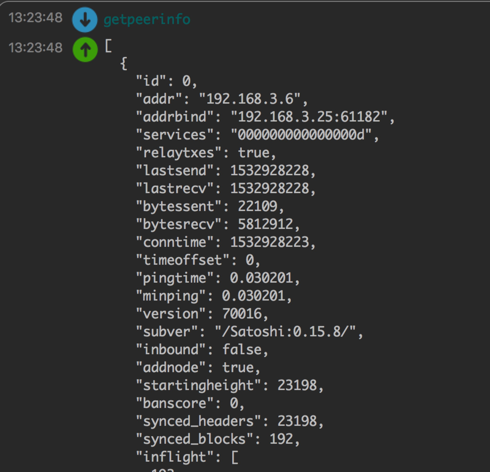
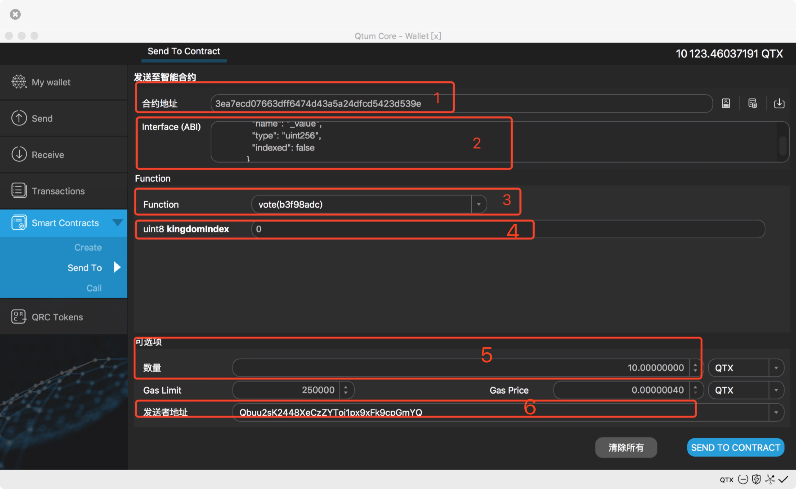
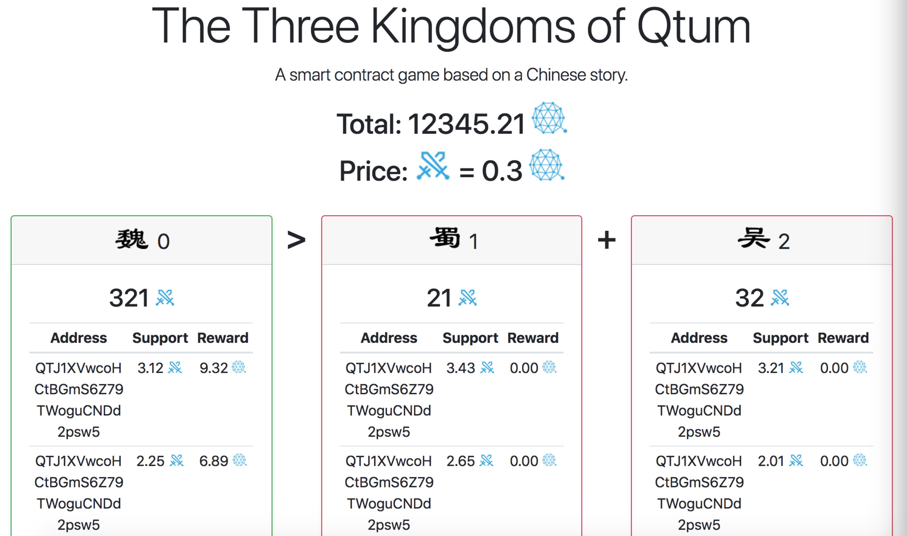
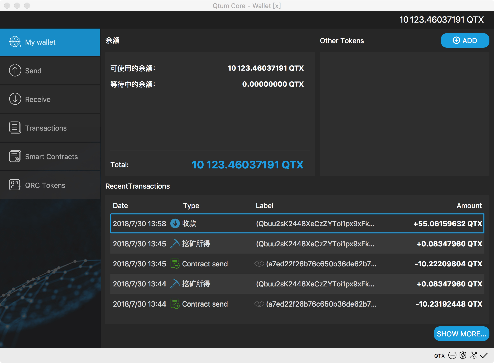

# ThreeKingdoms
##WHAT IS IT?
A Dapp Game based on the Legend of Threekingdoms.
There are three kingdoms as wei, shu and wu. U can support the kingdom u like or the winer u suppose. The balance will update in time when there is a new deposits, and the remaining time will be 30 blocks as initial status.The earlier u support, the cheaper of the key. U can see the key price from the website page.

##WHEN THE END?
The remaining block will reduce as the real block growth. When the remaining block is 0, the game is over.

##WHO WILL WIN?
Suppose that total support of wei is A, shu is B, wu is C. There are two ways for a kingdom to win at the end (maybe two winers).
1. if A > B AND A > C AND A > (B + C), then the winer is A, wei will get all values of shu and wu as profit.
2. if A > B AND A > C AND A < (B + C), then the winers is B AND C. shu and wu will get all values of wei in proportion.
If u are in the winning kingdom, u will get profit according to the proportion.

## How to play this game
Get a new address
input getnewaddress at the console

###Connect to test chain
input addnode xxx.xxx.xxx.xxx add at the console,then you can join the test chain.Attention:xxx.xxx.xxx.xxx is the IP address of a node in the test chain.

###Check the peer information
You can use getpeerinfo to check whether your node is added to the test chain.

###Vote for the country you support
Click the Send To button on the left side of the wallet under the Smart Contracts and input these information:
1. the contract address of the Three Kingdoms
2. the ABI of the contract
3. call the vote function to vote for the country you support
4. which country you are fighting for(0,1,2)
5. input how many tokens you want to vote
6. input voter's address

###Check your vote
You can check your vote at this [website](http://contract.games/)

###If you won this game,you will get reward.
the reward will send to each voter's address a few minutes after the end of the game

